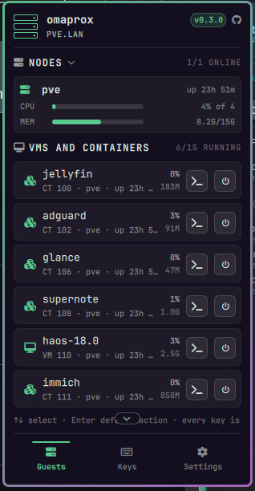
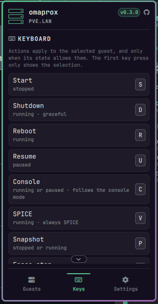
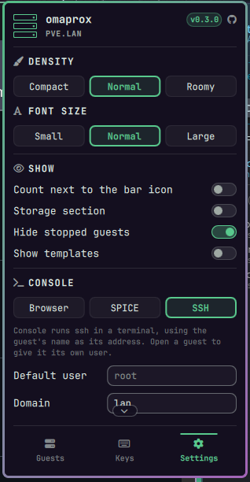

# Proxmox for Omarchy

A bar widget for Omarchy 4 (Quattro) that shows your Proxmox VE nodes, VMs, containers and
storage, and lets you start, shut down, reboot, snapshot, and open consoles without leaving
the keyboard.

- Bar icon with a `running/total` count; dims when the cluster is unreachable.
- Popup with node CPU/memory, every guest (status, CPU, memory, uptime, tags, locks) and storage usage,
  styled like tandem and omaudiopanel: a header with the version, cards, icon section labels, and Guests, Keys and Settings tabs along the bottom.
- Every VM and container card has its own buttons: a console button (browser, SPICE or ssh, as chosen
  in Settings) for guests that are running or paused, and a power button that starts a stopped guest or
  shuts a running one down. Click a card (or move to it with the arrow keys) to open it and see Reboot,
  SPICE, Snapshot and Force stop.
- Actions per guest, offered only when they make sense for its state: **S**tart, shut**D**own,
  **R**eboot, **F**orce stop (needs a second press), **C**onsole, SPICE (**V**), **P** snapshot, resume (**U**).
- One API call per refresh (`/cluster/resources`), so it works for a single node or a cluster.

## Screenshots

<p>
  
  
  
</p>

## Requirements

- Omarchy 4.0+
- `curl` and `jq` (the widget offers to install them: `omarchy pkg add curl jq`)
- Optional: `openssl` (certificate pinning in setup), `virt-viewer` (SPICE consoles)

## Install

```sh
omarchy plugin add https://github.com/thevideinfra/omaprox.git --enable
```

For a local checkout, link it into `~/.config/omarchy/plugins/videinfra.omaprox` (the folder name must
match the plugin id) and run `omarchy plugin enable videinfra.omaprox --section right`. Restart the
shell after QML edits, since linked plugins do not hot reload.

## First run

1. Open the panel, go to the **Settings** tab and type your **Host** (name or IP; the port defaults to
   8006) under Connection, then press **Apply**.
2. Click the bar icon and choose **Set up token and certificate** (or press `T`). A terminal opens,
   asks for your API token (input hidden), saves it to `~/.config/omaprox/token` with mode 600,
   offers to pin the server certificate, and tests the connection.

Create the token in Proxmox under *Datacenter → Permissions → API Tokens*, then grant a role:

| Goal | Role | Path |
| --- | --- | --- |
| View only | `PVEAuditor` | `/` |
| Power actions, snapshots, console | a role with `VM.Audit`, `VM.PowerMgmt`, `VM.Console`, `VM.Snapshot` (`PVEVMUser` should cover these; check on your version) | `/vms` |

If "Privilege Separation" is ticked, the roles must be granted to the token itself.

## Keys

`↑ ↓` select guest · `Enter` start (stopped) / console (running) · `S D R F C V P U` actions ·
`G` refresh · `O` open web UI · `T` setup · `Esc` close. The first action key only reveals the
selection, so nothing fires blind. Force stop asks for a second press within 3 seconds.

Bar: left click opens the panel, right click refreshes, middle click opens the Proxmox web UI.

## Settings

| Setting | Default | Meaning |
| --- | --- | --- |
| Density / Font size | normal / normal | Compact, normal or roomy; small, normal or large. Set from the Settings tab. |
| Proxmox host | *(blank)* | Name or IP. `host:port`, `https://host:port/` and `[v6]:port` also work. |
| API port | 8006 | |
| Refresh interval | 15 s | 5–600. Actions trigger extra refreshes after 1.5 s and 5 s. |
| CA/server certificate file | *(blank)* | Blank uses `~/.config/omaprox/pve.pem` if setup pinned one, else system trust. |
| Skip TLS verification | off | Escape hatch for lab setups. Not recommended. |
| Only show guests matching | *(blank)* | Substring of name, id, node or tag. |
| Hide stopped guests / Show templates | off / off | |
| Show the storage section | on | |
| Collapse the nodes section | off | Click the NODES label (its chevron) to fold the node cards away; the online count stays on the label. |
| Show running/total in bar | on | |
| Console opens in | browser | `browser` (noVNC), `spice` (`remote-viewer`) or `terminal` (ssh). Pick it in the Settings tab. The old `preferSpice: true` still means `spice`. |
| SSH user / SSH domain | root / *(blank)* | Terminal mode runs `ssh user@name.domain` in your terminal. The guest's name is the address, so it must resolve and accept your key; set the domain if it needs one (`lan`). Both are text boxes in the Settings tab (under Console). |
| Per-guest SSH user | *(none)* | Open a guest's card in terminal mode and type a user in its "SSH as" box; Enter stages it for that guest and Apply saves it; blank goes back to the default. Stored as `sshUsers` in `shell.json`. |

The Settings tab covers density, font size, the show/hide switches and the console mode, which save at once,
and text boxes for host, port and the SSH user and domain, which are staged as in tandem: as soon as you
type, the box turns accent-coloured and a banner above the tabs shows "N pending" with **Revert** and
**Apply**. Apply writes them all, Revert drops them. Enter only leaves the box, and Esc puts that box's
saved value back. An invalid value turns red and is not staged. Per-guest SSH users are
staged the same way. The Keys tab lists every key. The certificate path and name filter are only in the
widget's settings.

## Scripting (IPC)

```sh
omarchy-shell videinfra.omaprox toggle
omarchy-shell videinfra.omaprox refresh
omarchy-shell videinfra.omaprox version   # the plugin version, from manifest.json
omarchy-shell videinfra.omaprox page keys   # guests, keys or settings
omarchy-shell videinfra.omaprox running    # "3/7"
omarchy-shell videinfra.omaprox status     # "Connected" or the current error
omarchy-shell videinfra.omaprox guests     # JSON
```

## Security model

Omarchy plugins run unsandboxed, so read the code: it is small.

- The token lives in `~/.config/omaprox/token` (or `$OMAPROX_TOKEN`), never in `shell.json`, so
  dotfile repos that track `shell.json` do not leak it. A group/world-readable token file is flagged in the panel.
- The token is passed to `curl` as a header over stdin (`-H @-`), not on the command line, so it is
  not visible in `ps`. `test/run.sh` checks this while a request is in flight.
- TLS is verified. Self-signed Proxmox certificates work by pinning them during setup. You are
  shown the SHA-256 fingerprint and asked before anything is trusted. The pinned file is the server
  certificate, so re-run setup when Proxmox renews it.
- Host, node, guest type and VM id are validated before they reach a URL.
- Destructive actions are limited to force stop (confirmed) and nothing deletes or rolls back.
  Snapshots are created as `omaprox-YYYYmmdd-HHMMSS`; rollback and delete are deliberately left out.
- The SPICE connection file holds a one-time ticket, so it is created mode 600 and Proxmox marks it
  for deletion after `remote-viewer` reads it.

## Known limits

- The noVNC console opens the Proxmox web UI console URL in your browser, so you need to be logged
  in to Proxmox in that browser. The URL follows the pattern the web UI itself uses.
- Guest actions are queued asynchronously by Proxmox. The widget reports "requested", then re-polls.
- No HA, backup-job, task-log or snapshot-browser views yet.

## Tests

```sh
bash test/run.sh        # scripts against a mock Proxmox API (TLS, auth, actions, SPICE, setup, ps leak check) + Model.js
bash test/run-qml.sh    # Panel.qml/Service.qml headless, with stubbed Omarchy/Quickshell modules
```

These use a mock server and stubbed UI modules. They have not been run against a real Proxmox
cluster or inside a real `omarchy-shell`, so report anything odd you see there.

## License

MIT
